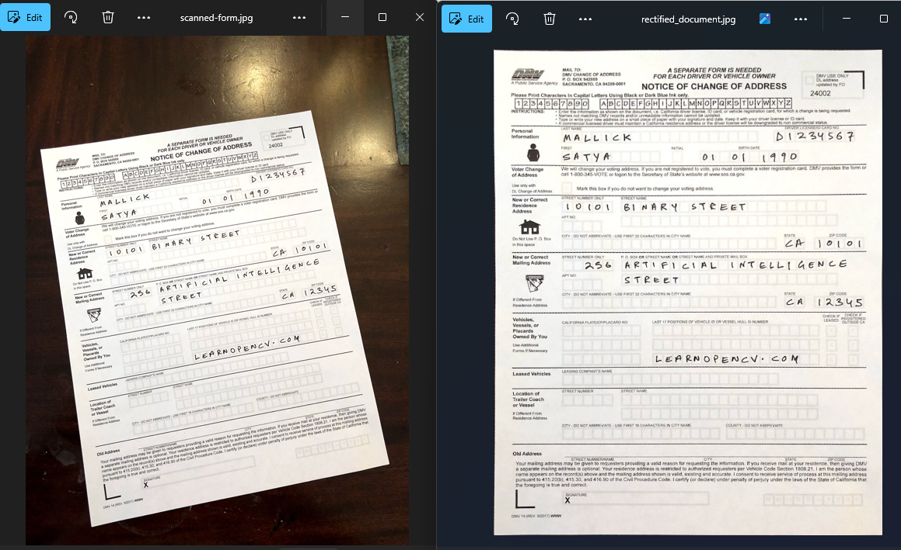

# Document Scanner

This project is a simple document scanning tool implemented in Python using OpenCV. It identifies the contours of a document in an image, applies a perspective transformation to rectify it, and outputs a neatly cropped and flattened version of the document.

---

## Features
- Automatically detects the largest document-like contour in an image.
- Applies a perspective transformation to straighten and rectify the document.
- Outputs a resized and cleaned-up image of the document for easier readability.

---

## How It Works
1. **Image Preprocessing**:
   - Converts the input image to grayscale.
   - Applies Gaussian blur to reduce noise.
   - Uses Canny edge detection to identify edges.
2. **Contour Detection**:
   - Finds contours and selects the one most likely to represent the document.
3. **Perspective Transformation**:
   - Transforms the document to appear flat and rectangular.
4. **Output**:
   - Resizes the output image to a fixed width for consistency.
   - Saves the rectified document as an image file.

---

## How to run
`pip install opencv-python-headless numpy`
  

